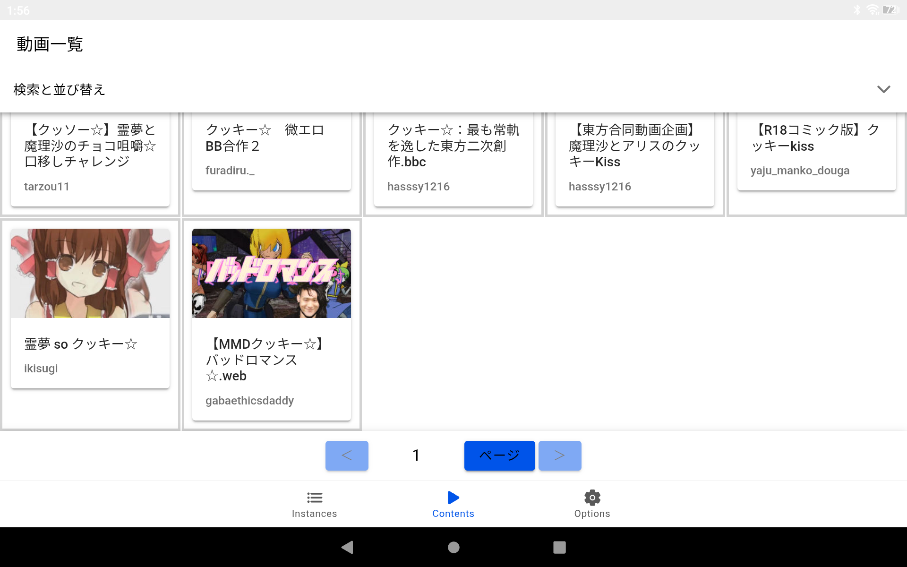

# Yaju-Tube

A Peertube video player app, originating from the Japanese internet culture community.<br>
The name and icon are intentionally casual.

<div align="center">

<p>・Github Pages<br>
<a href="https://pyu224.github.io/Yaju-Tube/">https://pyu224.github.io/Yaju-Tube/</a></p>

<p>・Repository<br>
<a href="https://github.com/PYU224/Yaju-Tube">https://github.com/PYU224/Yaju-Tube</a></p>

<p>・Download<br>
<a href="https://github.com/PYU224/Yaju-Tube/releases">https://github.com/PYU224/Yaju-Tube/releases</a></p>

</div>

**[🇯🇵 日本語版はこちら (Japanese README)](README.ja.md)**

**[🇬🇧 English README](README.md)**

## Overview

<div align="center">

<p></p>

</div>

<p>This is a Peertube video player app I created because the official Peertube app was too slow to use. I built it with the help of AI while learning on my own.</p>

<p>The app is functional but still under active development.<br>
Bug reports and feature requests are welcomed via the Issues section.</p>

## Building from Source

### Requirements
- Node.js 16 or higher with npm
- JDK 17 or higher
- Android SDK

### Build Instructions
```bash
# Clone the repository
git clone https://github.com/PYU224/Yaju-Tube.git
cd Yaju-Tube

# Install dependencies (including dev dependencies)
npm install

# Build the web application
npm run build

# Generate app icons and splash screens
npx @capacitor/assets generate

# Sync with Capacitor
# (Note: The android folder is already included in the repository)
npx cap sync android

# Build the Android APK
cd android
./gradlew assembleRelease
```

The generated APK will be located at ```android/app/build/outputs/apk/release/app-release.apk.```

## Technical Details

Framework: Vue.js 3 + Capacitor 6
Build System: Vite
Java Compatibility: Java 17 (JDK 17 or higher required)
Target Android: minSdkVersion 23, targetSdkVersion 35

## Build Notes

This is a Capacitor-based hybrid application
Java 17 or higher is mandatory (Java 8 or 11 will cause "invalid source release 21" errors)
The android/build.gradle includes settings to enforce Java 17 across all subprojects
The android folder is included in the repository, so npx cap add android is not necessary

## Roadmap
The primary goal is to make the app stable and reliable.<br>
<p>Once stable, the app will be published on F-Droid for distribution.<br>
<a href="https://f-droid.org/">https://f-droid.org/</a></p>

### High Priority

- Loop playback toggle (ON/OFF)
- Playlist feature (with import/export functionality including settings)
- ~~Landscape fullscreen mode with video orientation switching (like YouTube or official Peertube app)~~
- ~~Additional video sorting options beyond "newest first"~~

### Medium Priority

- Instance login functionality
- Comment viewing and posting
- ~~Light mode and dark mode (Completed)~~
- Multi-language support (English translation mostly complete)
- ~~Customizable video list display settings~~

### Low Priority

- Live chat comment viewing and posting (Peertube extension feature, lower priority)
- Ad-free YouTube and Niconico video playback (likely difficult to implement)
- Video upload functionality to selected Peertube instances (would need to consider upload restrictions)
- XMR mining (interesting but potentially problematic)

## Contact
- Links<br>
https://linksta.cc/@pyu224

## License
GPL-3.0