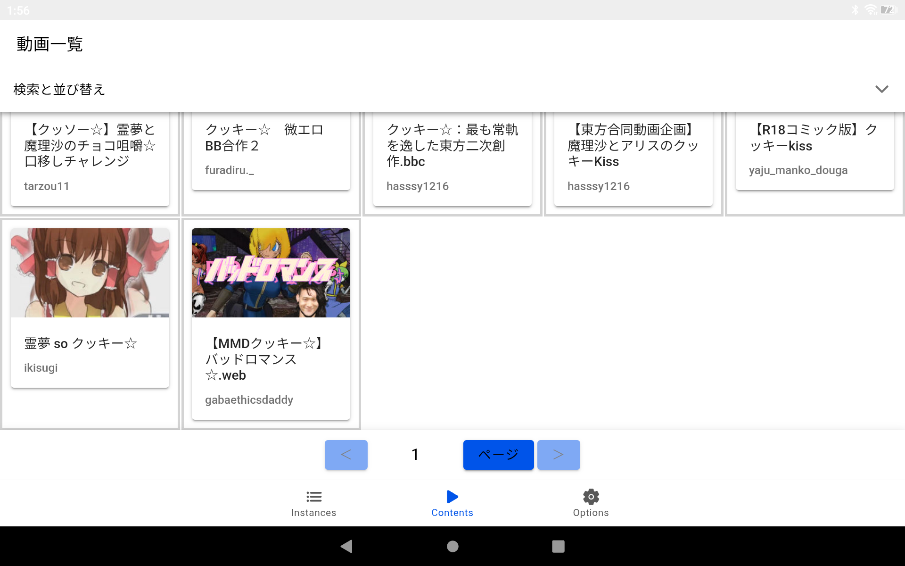

# Yaju-Tube
恐らく淫夢といった例のアレ発のPeertubeの再生プレイヤーアプリです。 
名前とアイコン画像は適当です。

・Github Pages 
<a href="https://pyu224.github.io/Yaju-Tube/">https://pyu224.github.io/Yaju-Tube/</a>

・Repository 
<a href="https://github.com/PYU224/Yaju-Tube">https://github.com/PYU224/Yaju-Tube</a>

・Download 
<a href="https://github.com/PYU224/Yaju-Tube/releases">https://github.com/PYU224/Yaju-Tube/releases</a>

## 概要

これはPeertubeの公式アプリが重くて使えなかったので、AIに頼りつつ独力で何かできないかと思って作ってみたPeertubeの動画再生アプリです。

一応動きますがまだまだ開発途中です。 
主にここのIssueでバグ報告やリクエストを受け付けています。

## ロードマップ
まずは安定して動くようにしたいです。 

安定して動くようになったらApkファイルをF-Droidに登録して配布する形になります。 
<a href="https://f-droid.org/ja/">https://f-droid.org/ja/</a>

### 重要度：高
- ループ再生のON・OFF
- マイリスト機能（設定も込みでインポート・エクスポート機能付きを想定）

### 重要度：中
- インスタンスへのログイン機能
- コメント欄の閲覧と書き込み
- ライトモードとダークモード
- 多言語訳

### 重要度：低
- ライブチャットのコメント欄の閲覧と書き込み（Peertubeの拡張機能だから後回し）
- Youtubeやニコニコ動画を広告なしで閲覧できる機能（多分難しい）
- Peertubeのインスタンスを選んで動画を投稿する機能（アプリで動画を投稿する場合は投稿制限にも配慮する必要があるはず）
- XMRのマイニング（面白そうだが弊害が多そう）

## 連絡先
- リンク集 
https://linksta.cc/@pyu224

## ライセンス
GPL-3.0で考えています。